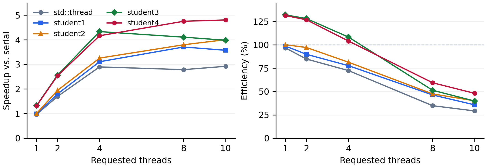
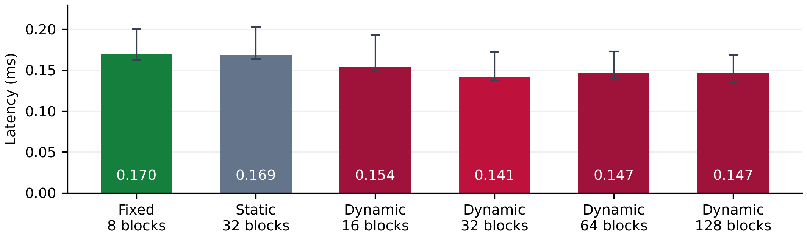
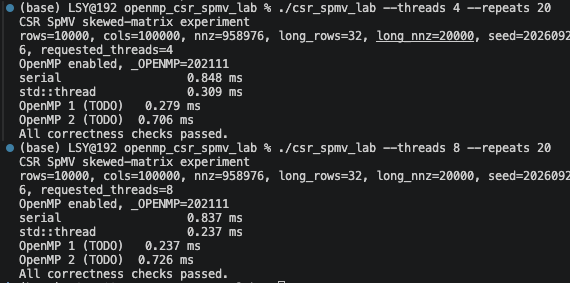

# OpenMP CSR SpMV 并行策略实验报告

## 1. 实验目标与策略设计

CSR 稀疏矩阵向量乘按行计算 $y_i=\sum_{p=row\_ptr[i]}^{row\_ptr[i+1]-1}values[p]\,x[col\_idx[p]]$。不同行的输出独立，但行长偏斜会使等量行数对应不同工作量。本实验研究：按行动态调度能否改善偏斜负载，按 NNZ 划分能否拆开长行，以及更细的动态 NNZ 块是否值得额外调度开销。

| 实现 | 工作划分与调度 | 长行可拆分 | 段内 SIMD |
| --- | --- | :---: | :---: |
| row_static | 按行 `schedule(static)` | 否 | 否 |
| row_dynamic | 按行 `schedule(dynamic,128)` | 否 | 否 |
| student1 | 每个实际线程固定一个连续 NNZ 块 | 是 | 是 |
| student2 | 约每个请求线程 4 个 NNZ 块，`dynamic,1` | 是 | 是 |

`row_static` 开销小，但长行可能集中在某个线程；`row_dynamic` 动态领取 128 行一组的任务，兼顾均衡与领取开销，但仍无法拆开单条长行。`student1` 将非零数组均分为 $P$ 个区间，每线程自行通过 `upper_bound` 找到对应行；完整行直接写输出，边界行先保存部分和，退出并行区后按块编号合并。每块至多记录两个边界行，因此无需对每个乘加使用原子操作。

`student2` 延用相同计算与合并代码，将块数增至约 $4P$，使先完成的线程可以继续领块。这里 `dynamic,1` 的一个任务是 NNZ 块，而不是一行；请求 8 线程时，默认矩阵约分成 32 块，每块约 3 万 NNZ。NNZ 很少时限制块数，全空矩阵保留一个块。

## 2. 环境、参数与测量方法

硬件为 MacBook Air、Apple M5、24 GB 内存，10 个 CPU 核心（4 个性能核、6 个能效核）；系统 macOS 26.5.2，编译器 Apple Clang 21.0.0，OpenMP 运行库 Homebrew libomp 23.1.2。所有策略统一使用 `-O2 -std=c++17 -pthread`，通过 `-Xpreprocessor -fopenmp` 和 `-lomp` 启用 OpenMP；未使用 `-O3`、`-march=native` 或 `-ffast-math`，未设置线程绑定。

默认矩阵为 10000 行、100000 列，普通行 32 NNZ，32 条长行各 20000 NNZ，总 NNZ 为 958976，随机种子为 20260926。研究线程数 1、2、4、8、10，另外改变规模、偏斜程度、调度及随机种子。每个配置进行 10 轮实验，每轮各策略预热一次、验证结果后计时 100 次，使用 `steady_clock`；轮内策略顺序随机打乱。报告采用每轮平均耗时的中位数，原始数据同时保存最小值和最大值。

矩阵生成、随机数、正确性检查和打印不计入计时；线程创建回收、NNZ 临时数组分配、边界搜索、同步与合并均计入。所有输入、编译选项及计时范围对各策略一致。

加速比定义为 $S_P=T_s/T_P$，并行效率为 $E_P=S_P/P$，其中 $T_s$ 始终指纯串行基线。默认矩阵线程扩展分析固定采用 `default_t1` 中的串行中位数 **0.668883 ms**，避免随线程档位更换分母。

正确性保留原串行参考与 $10^{-10}$ 绝对、相对误差判定。所有正式策略通过报告测量中的检查；NNZ 两策略另通过 7524 次边界与随机矩阵检查，包括空行、全空、线程数多于 NNZ、单行跨多个块及更换向量后重复调用。优化构建、地址/未定义行为检查、实际线程数受限及关闭 OpenMP 的回退运行均通过。拆行与 SIMD 会改变浮点累加顺序，未放宽误差标准。

\newpage

## 3. 默认矩阵性能与线程扩展

下表为默认矩阵 8 线程结果，时间单位 ms；串行基线取上一节固定值。

| 实现 | 中位耗时 | 加速比 $S_8$ | 效率 $E_8$ |
| --- | ---: | ---: | ---: |
| serial | 0.6689 | 1.00 | 不适用 |
| std::thread | 0.2400 | 2.79 | 34.8% |
| row_static | 0.1805 | 3.71 | 46.3% |
| row_dynamic | 0.1761 | 3.80 | 47.5% |
| student1 | 0.1629 | 4.11 | 51.3% |
| student2 | 0.1407 | 4.75 | 59.4% |

`row_dynamic` 相对 `row_static` 改善约 2.4%，本次配置中收益有限；NNZ 固定块加入拆行及 SIMD 后进一步改善。`student2` 比 `student1` 耗时降低 **13.6%**，比 `row_dynamic` 降低 **20.1%**。这些是同一次统一测量的结果，不与早期优化数据混算。

| 线程数 $P$ | student1 时间 | student2 时间 | student2 加速比 | student2 效率 |
| ---: | ---: | ---: | ---: | ---: |
| 1 | 0.5061 | 0.5089 | 1.31 | 131.4% |
| 2 | 0.2610 | 0.2636 | 2.54 | 126.9% |
| 4 | 0.1544 | 0.1606 | 4.16 | 104.1% |
| 8 | 0.1629 | 0.1407 | 4.75 | 59.4% |
| 10 | 0.1680 | 0.1392 | 4.81 | 48.1% |

{width=16.8cm}

`student1` 从 4 扩至 8、10 线程反而变慢；`student2` 能继续小幅改善，但 8 到 10 线程的收益仅约 1.1%，效率明显下降。SIMD 策略在单线程下也快于原串行，故上述效率不能仅用于评价线程扩展能力。若以 `student2` 自身单线程时间为参照，其 10 线程扩展比为 **3.66**，相应效率约 **36.6%**。

两种线程 API 都适合按行独立计算。当前 `std::thread` 基线每次调用都创建并回收线程，OpenMP 运行时通常可复用工作线程，因而短任务开销不同；`student2` 比该基线快约 **41.4%**，但这同时包含工作划分与 SIMD 的影响，不能全部归因于线程复用。OpenMP 简化循环调度；自定义线程池、任务队列、线程间通信及线程生命周期控制则更适合采用 `std::thread`。本实验未改造线程池基线。

\newpage

## 4. 规模、偏斜与随机性

以下配置均为 8 线程，时间单位 ms。A：普通行 1 NNZ、仅 1 条长行 100000 NNZ；B：无长行，其余默认；C：20000 行、200000 列、普通行 16 NNZ、16 条长行各 80000 NNZ；D/E：默认矩阵，种子改为 7/42。

| 配置 | row_static | row_dynamic | student1 | student2 |
| --- | ---: | ---: | ---: | ---: |
| A：单条长行占主导 | 0.1049 | 0.0946 | 0.0359 | 0.0376 |
| B：均匀短行 | 0.0674 | 0.0667 | 0.0656 | 0.0646 |
| C：较大偏斜矩阵 | 0.4652 | 0.2744 | 0.2583 | 0.2262 |
| D：seed=7 | 0.2034 | 0.1917 | 0.1772 | 0.1424 |
| E：seed=42 | 0.2081 | 0.1738 | 0.1698 | 0.1437 |

A 中按行策略无法协同处理唯一长行，NNZ 拆分优势突出；但细分动态块的收益不足以抵消开销，`student2` 比 `student1` 慢约 **4.8%**，是负优化案例。默认 4 线程下也存在类似现象。B 中策略差距很小，均匀短行没有明显的负载均衡需求。C 中 `student2` 比 `student1` 快 **12.4%**；C 同时改变规模和偏斜，只作为组合压力测试，不用于隔离某一变量的贡献。D/E 中该收益约为 **19.6%/15.4%**，说明改善不只出现在默认种子，但不能据此推广到任意稀疏矩阵。

## 5. 消融：小块数量与动态调度

采用独立的 NNZ 调度驱动，保持相同乘加、SIMD 及部分和合并，只改变块数和调度；默认矩阵、8 线程、10 轮，每轮 100 次。该实验与正文统一测量属于不同运行批次，以下数值只在本组内部比较。

{width=16.8cm}

固定 8 块为 0.169632 ms；划成 32 个 static 块为 0.168885 ms，单纯细分收益很小。相同的 32 块采用 dynamic 后降至 0.141329 ms，支持动态领取任务能减少本例等待时间的解释。16、64、128 个 dynamic 块分别为 0.153695、0.147112、0.146650 ms；块越多并未持续改善，领取任务、边界查找、部分和写入及合并开销需要权衡，因此选择每线程约 4 块。

此外，早期 NNZ 策略消融中，默认 8 线程的无 SIMD 精确切块为 0.196690 ms，加入 SIMD 后为 0.163355 ms。该独立实验以及正文单线程结果表明，段内累加优化确实贡献了收益，不能将 NNZ 策略的全部加速解释为负载均衡。

\newpage

## 6. Linux perf：未完成的测量

**本报告尚未包含作业要求的 Linux `perf stat` 数据。** 当前测量环境为 macOS，暂无法使用可用的 Linux 测量环境，因此 `cycles`、`instructions`、`cache-misses`、上下文切换和 CPU 迁移等事件均未采集。本节明确记录缺项，不用运行时间推算硬件计数器。

已有实验支持“动态 NNZ 小块在部分配置上更快”，但不能确定线程扩展下降主要来自内存带宽、缓存失效、异构核心调度还是运行时开销。后续在 Linux 上应对纯串行、原始 `std::thread` 和一个 OpenMP 策略分别测量；需要单策略入口，避免把同时执行多个策略的计数器归因给某个内核。Linux 环境数据也应单独标注，不能与本机 M5 时间直接混算。

## 7. 结论与局限

按行 static 的优势是简单和调度开销小；按行 dynamic 可缓解行间不均衡，但不能拆开单条长行。NNZ 拆分加 SIMD 对强偏斜输入更有效；动态小块进一步改善了默认 8 线程及组合压力配置，但在低线程数、任务较小或已有负载均衡时可能负优化。最终保留四种策略以展示这些权衡。

默认矩阵中 `student2` 达到 0.1407 ms（8 线程），相对固定纯串行基线为 4.75 倍加速；增加至 10 线程达到 0.1392 ms，加速 4.81 倍，但边际收益很小。当前均分模型只考虑 NNZ，没有包含每行固定开销；随机读取 `x`、缓存行为、内存带宽及线程运行速度仍可能影响性能。每线程 4 块是本机经验参数，不能保证跨机器最优。

实验局限还包括：只有合成 CSR 输入，未测试真实矩阵数据集；未固定 CPU 频率或绑定线程；10 轮存在离散波动，未进行显著性检验；尚缺 Linux `perf` 数据。报告中的解释以测量支持的范围为限。

## 8. 可复现性、AI 使用与参考资料

当前最终代码的统一实验驱动为 `report/benchmark_report.cpp`，配置脚本为 `report/measure_report.py`，原始与汇总数据为 `report/measurements_raw.csv`、`report/measurements_summary.csv`。NNZ 调度消融数据位于 `experiments/nnz_schedules_*.csv`，早期 SIMD 消融见 `student3_optimization.md`，数据备份在 `report/supplement/`。最小值与最大值保留在 CSV，核心结论已在正文给出。

学生完成 `row_static`、`row_dynamic` 及初版 `student1`；OpenAI Codex 协助后续 NNZ 优化设计、实现、验证、实验脚本、图表及本报告初稿。正式提交前由学生核实数据、代码和结论，并按要求附相关对话截图。心路历程报告另由学生本人撰写，本文不代写该部分。

参考资料：

1. 课程作业文档《实验一：OpenMP CSR SpMV 并行编程》及项目 `README.md`。
2. OpenMP ARB. [OpenMP API Specification 5.2](https://www.openmp.org/wp-content/uploads/OpenMP-API-Specification-5-2.pdf)，parallel、worksharing-loop、schedule 与 simd reduction。
3. cppreference. [std::thread](https://en.cppreference.com/w/cpp/thread/thread.html)。
4. Linux manual pages. [perf-stat(1)](https://man7.org/linux/man-pages/man1/perf-stat.1.html)。

\newpage

# 附录 A：正确性证据与复现

下面为学生已有的早期 `row_static`/`row_dynamic` 运行截图。截图时间属于早期探索，不参与正文最终版本的定量比较，也不作为 `student1`/`student2` 的验证证据。

{width=14.5cm}

最终 NNZ 策略的 `experiments/check_nnz_strategies.cpp` 每次先把输出填为 NaN，再检查所有行有限且满足原误差判定。两个策略各 3762 次、共 7524 次检查，正式优化构建、地址/未定义行为检查构建、`OMP_DYNAMIC=true OMP_THREAD_LIMIT=2` 运行和关闭 OpenMP 的回退分别通过。地址检查构建未成功向量化，故另用正式 `-O2` 构建验证 SIMD 数值结果。

在项目根目录复现正文数据：

```bash
clang++ -O2 -std=c++17 -Xpreprocessor -fopenmp \
  -I/opt/homebrew/opt/libomp/include \
  -L/opt/homebrew/opt/libomp/lib \
  -Wl,-rpath,/opt/homebrew/opt/libomp/lib \
  -lomp -pthread report/benchmark_report.cpp \
  -o /private/tmp/spmv_report_bench
python3 report/measure_report.py /private/tmp/spmv_report_bench
```

正文图表由 `report/make_figures.py` 读取 CSV 生成。调度消融的复现命令见 `experiments/README.md`。最终源码中共注册四个 OpenMP 策略，均经过原 `benchmark_ms` 的预热及正确性检查。
